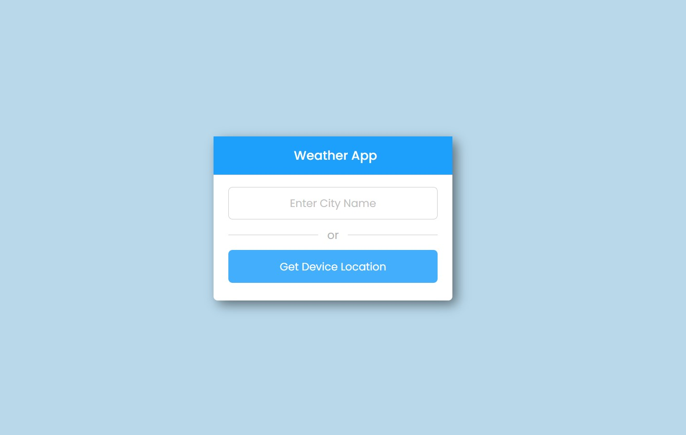

## Major Project by Technook (Weather App which will show the current weather and 5 day forecast)

_This is the final major project which is given by teachnook in order to completion of web development training. For major project inhave developed a weather app with HTML, CSS and Javascript. I have used Open Weather Map API to display the current weather of city. Weather details include Weather, Temperature, Weather Icon, Humidity, Feels Like and Wind Speed. And to display the next 5 day forecast i have used WeatherBit API. For 5 day forecast i have displayed Day-Name, Temperature and WeatherIcon._

# Click on below link to see the project

[MajorProject](https://major-project-teachnook.netlify.app/)

# SOme of the project screen shot

# Acknowledgement

_For the development of project i have taken help form https://www.codingnepalweb.com/ ._
